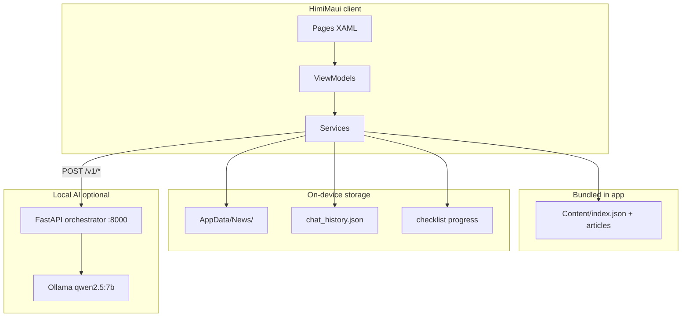

# Architecture

Himi is an **offline-first** mobile app with an optional **local AI backend** for demo/education.

## High-level overview



## Client layers (MAUI)

| Layer | Location | Role |
|-------|----------|------|
| UI | `HimiMaui/Pages/` | XAML screens |
| View models | `HimiMaui/ViewModels/` | MVVM state, commands |
| Services | `HimiMaui/Services/` | Data access, news, AI, i18n |
| Models | `HimiMaui/Models/` | DTOs and records |
| DI | `HimiMaui/MauiProgram.cs` | Service registration |

Navigation uses Shell routes registered in `AppShell.xaml.cs` (e.g. `Article`, `Chat`, `News`).

## Data storage

### Handbook (read-only, shipped with app)

```
HimiMaui/Content/
  index.json
  articles/{ua,pl,ru}/*.md
```

Loaded via `IContentRepository` / `ContentRepository`.

### News (cached on device)

```
AppData/News/
  index.json
  articles/{id}.md
  translations/{id}_{lang}.md
```

Managed by `NewsStore` and refreshed by `NewsService` from gov.pl RSS sources.

### Chat history (device only)

```
AppData/chat_history.json
```

Managed by `ChatHistoryStore`. The AI server is **stateless** — no chat persistence on the server.

### Checklist progress

Stored locally via `ChecklistProgressStore`.

## AI features

| Feature | Client | Server endpoint |
|---------|--------|-----------------|
| General chat | `AssistantService` | `POST /v1/chat` |
| Chat about article | `AssistantService` | `POST /v1/chat-about-article` |
| Translate news | `TranslationService` | `POST /v1/translate` |

- Prompts are **English** files in `ai-server/orchestrator/prompts/`.
- Reply language follows the user's message; UI language is a fallback hint.
- **Stub mode** (toggle on Home): client returns placeholder responses without network.
- Android emulator reaches the host via `http://10.0.2.2:8000` (`AiSettingsService`).

## Design principles

- **Offline-first**: handbook and cached news work without AI.
- **No RAG**: article Q&A sends full markdown in the request body.
- **Client-side guard**: block duplicate sends, cancel in-flight chat requests.
- **Demo scope**: no auth, no production hardening.

See also: [AI server getting started](getting-started/ai-server.md), [ai-server README](../ai-server/README.md).
